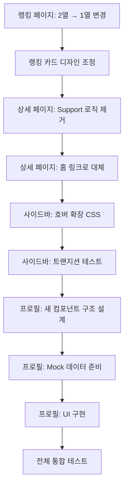

# [Step 10: 랭킹 레이아웃 개선, 상세 페이지 정리 및 사이드바 UX 고도화]

## 1. 개요 (Overview)

9단계에서 홈 화면의 캐러셀 인터랙션과 브랜드 타이틀을 혁신했습니다. 이번 10단계에서는 **랭킹 페이지의 레이아웃을 단순화**하고, **회사 상세 페이지에서 불필요한 Support 로직을 제거**하여 역할을 명확히 분리합니다. 또한 **사이드바에 호버 확장 기능**을 추가하여 좁은 상태에서도 텍스트를 확인할 수 있도록 개선하고, **프로필 페이지의 기획을 완전히 재설계**합니다.

---

## 2. 핵심 목표 (Key Objectives)

| 우선순위 | 영역             | 목표                                            |
| -------- | ---------------- | ----------------------------------------------- |
| Critical | 랭킹 페이지      | 2열 그리드 → 1열 세로 나열로 변경               |
| High     | 회사 상세 페이지 | Support 버튼을 홈으로 링크 변경, 관련 로직 제거 |
| Medium   | 사이드바         | 좁은 상태(72px)에서 마우스 호버 시 확장(244px)  |
| High     | 프로필 페이지    | 기획 재설계 - KCL 앱에 맞는 새로운 구조         |

---

## 3. 랭킹 페이지 레이아웃 개선 (Ranking Page Layout)

### 3.1 현재 문제점

```
현재 (2열 그리드):
┌─────────────────────────────────────┐
│  [1st League]    │    [2nd League]  │
│  ┌───┐  ┌───┐   │   ┌───┐  ┌───┐  │
│  │ 1 │  │ 2 │   │   │11 │  │12 │  │
│  └───┘  └───┘   │   └───┘  └───┘  │
│  ┌───┐  ┌───┐   │   ┌───┐  ┌───┐  │
│  │ 3 │  │ 4 │   │   │13 │  │14 │  │
│  └───┘  └───┘   │   └───┘  └───┘  │
└─────────────────────────────────────┘

문제점:
- 순위 흐름이 좌→우→다음줄로 끊김
- 모바일에서도 동일한 패턴 유지 어려움
- 순위 비교가 직관적이지 않음
```

### 3.2 개선 목표

```
개선 후 (1열 세로 나열):
┌─────────────────────────────────────┐
│         [1st League] [2nd League]   │  ← 탭 전환
├─────────────────────────────────────┤
│  ┌─────────────────────────────┐    │
│  │ 🥇 1. HYBE          154.2M  │    │
│  └─────────────────────────────┘    │
│  ┌─────────────────────────────┐    │
│  │ 🥈 2. SM Ent.       128.5M  │    │
│  └─────────────────────────────┘    │
│  ┌─────────────────────────────┐    │
│  │ 🥉 3. JYP Ent.      110.2M  │    │
│  └─────────────────────────────┘    │
│  ┌─────────────────────────────┐    │
│  │    4. YG Ent.        98.0M  │    │
│  └─────────────────────────────┘    │
│              ...                    │
└─────────────────────────────────────┘

장점:
- 순위가 위에서 아래로 자연스럽게 흐름
- 1위부터 순차적으로 스크롤하며 확인 가능
- 모바일/데스크탑 동일한 사용 경험
```

### 3.3 구현 변경 사항

```scss
// ranking/page.module.scss
.rankingList {
  display: flex;
  flex-direction: column; // 1열 세로 나열
  gap: 12px;
  max-width: 600px; // 가독성을 위한 최대 너비
  margin: 0 auto; // 중앙 정렬

  // 그리드 관련 코드 제거
  // grid-template-columns: repeat(2, 1fr); ← 삭제
}
```

### 3.4 랭킹 카드 디자인 개선

1열 레이아웃에 맞게 카드 디자인도 조정:

```
┌────────────────────────────────────────────┐
│  🏆  [아이콘]  회사명                      │
│  1   [로고]   HYBE                   ▲ 2% │
│               Key: BTS, SEVENTEEN...       │
│               ━━━━━━━━━━━━━  154,200,300  │
└────────────────────────────────────────────┘
```

- 순위 숫자를 크고 강조
- 로고/아이콘 좌측 배치
- 회사명 + 소속 아티스트 표시
- 우측에 포인트 및 변동률 표시
- 하단에 프로그레스 바 (선택적)

---

## 4. 회사 상세 페이지 정리 (Company Detail Page)

### 4.1 역할 재정의

**Support(투표)는 홈 화면의 전유 기능**으로 정의합니다.

- 홈 화면: 회사 선택 + 투표 (핵심 인터랙션)
- 상세 페이지: 회사 정보 확인 (정보 열람)

### 4.2 변경 사항

| 항목         | Before               | After                                    |
| ------------ | -------------------- | ---------------------------------------- |
| Support 버튼 | 투표 기능 실행       | 홈으로 이동 링크                         |
| SupportModal | 상세 페이지에서 호출 | 제거                                     |
| 투표 로직    | 상세 페이지에 존재   | 홈 전용으로 이관                         |
| CTA 문구     | "Support Now"        | "Go to Home to Support" 또는 아이콘 링크 |

### 4.3 상세 페이지 UI 수정

```tsx
// company/[id]/page.tsx

// Before
<SupportModal ... />
<button onClick={openModal}>Support</button>

// After
<Link href={`/${locale}`} className={styles.supportLink}>
  <Home size={20} />
  <span>홈에서 서포트하기</span>
</Link>
```

### 4.4 제거 대상 코드

```typescript
// 상세 페이지에서 제거할 요소들
- useState for isModalOpen
- SupportModal import 및 컴포넌트
- 투표 관련 핸들러 (handleSupport, onVote 등)
- 투표 성공/실패 토스트 메시지
```

---

## 5. 사이드바 호버 확장 기능 (Sidebar Hover Expansion)

### 5.1 현재 동작

```
태블릿 (768px ~ 1263px):
┌──────┐
│ 🏠 │ ← 72px 고정, 아이콘만 표시
│ 🏆 │
│ 👤 │
│ ➕ │
└──────┘

데스크탑 (1264px+):
┌──────────────┐
│ 🏠 홈        │ ← 244px 고정, 아이콘 + 텍스트
│ 🏆 랭킹      │
│ 👤 프로필    │
│ ➕ 만들기    │
└──────────────┘
```

### 5.2 개선 목표

**태블릿 화면에서 마우스 호버 시 사이드바 확장**:

```
Default (72px):          Hover (244px):
┌──────┐                 ┌──────────────┐
│ 🏠 │   ─────hover────▶ │ 🏠 홈        │
│ 🏆 │                   │ 🏆 랭킹      │
│ 👤 │                   │ 👤 프로필    │
└──────┘                 └──────────────┘
                              ↓ mouse leave
                         ┌──────┐
                         │ 🏠 │
                         └──────┘
```

### 5.3 구현 방식

```scss
// Sidebar.module.scss

.sidebar {
  // 기본 설정
  width: 72px;
  transition: width 0.25s cubic-bezier(0.4, 0, 0.2, 1);
  overflow: hidden;

  // 태블릿 범위에서만 호버 확장 적용
  @media (min-width: 768px) and (max-width: 1263px) {
    &:hover {
      width: 244px;

      // 확장 시 레이블 표시
      .label {
        opacity: 1;
        transform: translateX(0);
      }

      // 확장 시 로고 텍스트 표시
      .kclLogo {
        display: block;
      }

      .kclIconLogo {
        display: none;
      }
    }
  }

  // 데스크탑에서는 항상 확장 상태
  @media (min-width: 1264px) {
    width: 244px;
  }
}

.label {
  // 기본: 숨김 (태블릿)
  @media (min-width: 768px) and (max-width: 1263px) {
    opacity: 0;
    transform: translateX(-10px);
    transition:
      opacity 0.2s,
      transform 0.2s;
  }

  // 데스크탑: 항상 표시
  @media (min-width: 1264px) {
    opacity: 1;
    transform: translateX(0);
  }
}
```

### 5.4 주의 사항

1. **메인 콘텐츠 오버랩**: 확장 시 사이드바가 콘텐츠를 가리지 않도록 `z-index` 조정
2. **트랜지션 부드러움**: `cubic-bezier`로 자연스러운 확장/축소
3. **접근성**: 키보드 포커스 시에도 확장 트리거 고려

---

## 6. 프로필 페이지 재기획 (Profile Page Redesign)

### 6.1 현재 문제점

현재 프로필 페이지는 **인스타그램 UI를 그대로 차용**했습니다:

- 게시물 수, 팔로워, 팔로잉 (KCL에서 의미 없음)
- 포스트 그리드 (KCL에서 게시물 개념 없음)
- 저장됨/태그됨 탭 (동일하게 불필요)

### 6.2 KCL 앱에 맞는 프로필 컨셉

**"나의 팬덤 활동 기록 및 통계"** 페이지로 재정의:

```
┌─────────────────────────────────────────────────┐
│                                                 │
│   [아바타]  username                            │
│             @kcl_user_123                        │
│             "최애는 하이브" 🏆                  │
│                                                 │
│   ┌─────────┬─────────┬─────────┐              │
│   │  투표수  │ 연속일  │  랭킹   │              │
│   │  1,234  │  15일   │  #42   │              │
│   │  VOTES  │ STREAK  │  RANK  │              │
│   └─────────┴─────────┴─────────┘              │
│                                                 │
├─────────────────────────────────────────────────┤
│                                                 │
│   🏆 나의 서포트 기록                           │
│   ┌─────────────────────────────────────┐      │
│   │ 1. HYBE         ████████████  78%   │      │
│   │ 2. SM Ent.      ████          15%   │      │
│   │ 3. JYP Ent.     ██             7%   │      │
│   └─────────────────────────────────────┘      │
│                                                 │
│   📅 최근 활동                                  │
│   ┌─────────────────────────────────────┐      │
│   │ 오늘  │ HYBE에 100포인트 서포트     │      │
│   │ 어제  │ SM에 50포인트 서포트        │      │
│   │ 3일전 │ JYP에 30포인트 서포트       │      │
│   └─────────────────────────────────────┘      │
│                                                 │
│   🎖️ 획득 뱃지                                 │
│   ┌─────────────────────────────────────┐      │
│   │ [🔥] [⭐] [🎯] [💎] [🌟]           │      │
│   └─────────────────────────────────────┘      │
│                                                 │
└─────────────────────────────────────────────────┘
```

### 6.3 프로필 구성 요소

#### A. 프로필 헤더

| 요소     | 설명                                   |
| -------- | -------------------------------------- |
| 아바타   | 기본 프로필 이미지 또는 선택한 아이콘  |
| 유저네임 | 사용자 표시 이름                       |
| 핸들     | @username 형식                         |
| 바이오   | 최애 회사 표시 (가장 많이 투표한 회사) |

#### B. 통계 섹션

| 지표        | 설명                          |
| ----------- | ----------------------------- |
| 총 투표수   | 지금까지 사용한 총 포인트     |
| 연속일      | 연속으로 투표한 일수 (Streak) |
| 글로벌 랭킹 | 전체 사용자 중 내 순위        |

#### C. 서포트 기록

- **도넛 차트** 또는 **가로 막대 차트**로 회사별 투표 비율 시각화
- Top 3 회사 하이라이트

#### D. 최근 활동 타임라인

- 최근 7일간의 투표 기록
- 날짜 + 회사 + 포인트 형식

#### E. 뱃지 컬렉션

획득 가능한 뱃지 예시:
| 뱃지 | 조건 |
|------|------|
| 🔥 열정팬 | 7일 연속 투표 |
| ⭐ 올스타 | 5개 이상 회사에 투표 |
| 🎯 집중형 | 한 회사에 1000포인트 이상 |
| 💎 VIP | 총 10,000 포인트 달성 |
| 🌟 레전드 | 글로벌 Top 100 진입 |

### 6.4 데이터 구조 (Mock)

```typescript
interface UserProfile {
  id: string;
  username: string;
  handle: string;
  avatar?: string;

  stats: {
    totalVotes: number; // 총 투표 포인트
    streak: number; // 연속 투표 일수
    globalRank: number; // 글로벌 순위
  };

  supportHistory: {
    companyId: string;
    companyName: string;
    percentage: number; // 전체 투표 중 비율
    totalPoints: number;
  }[];

  recentActivity: {
    date: string;
    companyId: string;
    companyName: string;
    points: number;
  }[];

  badges: {
    id: string;
    name: string;
    icon: string;
    unlockedAt?: Date;
    isLocked: boolean;
  }[];
}
```

---

## 7. 작업 순서 (Workflow)



---

## 8. 마스터 프롬프트 (Execution Prompt)

```markdown
# Phase 10: 랭킹 레이아웃 개선, 상세 페이지 정리 및 사이드바/프로필 고도화

**목표**: 랭킹 페이지를 1열 레이아웃으로 단순화하고, 상세 페이지에서 Support 로직을 제거하여
홈과의 역할을 명확히 분리합니다. 사이드바에 호버 확장 기능을 추가하고,
프로필 페이지를 KCL 앱에 맞게 완전히 재설계합니다.

## 1단계: 랭킹 페이지 레이아웃 변경

- [ ] **그리드 제거**: `grid-template-columns: repeat(2, 1fr)` 삭제
- [ ] **1열 플렉스**: `flex-direction: column`으로 변경
- [ ] **최대 너비**: `max-width: 600px`로 가독성 확보
- [ ] **중앙 정렬**: `margin: 0 auto` 적용
- [ ] **카드 디자인**: 1열에 맞게 가로형 카드로 조정 (순위 강조)

## 2단계: 회사 상세 페이지 Support 제거

- [ ] **SupportModal 제거**: import 및 컴포넌트 삭제
- [ ] **투표 상태 제거**: `isModalOpen`, `selectedCompany` 등 state 삭제
- [ ] **CTA 변경**: Support 버튼 → 홈으로 이동 링크 (`<Link href="/">`)
- [ ] **문구 변경**: "홈에서 서포트하기" 또는 홈 아이콘 링크

## 3단계: 사이드바 호버 확장

- [ ] **조건부 확장**: 768px~1263px 범위에서만 호버 시 244px로 확장
- [ ] **트랜지션**: `transition: width 0.25s cubic-bezier(0.4, 0, 0.2, 1)`
- [ ] **레이블 표시**: 호버 시 `.label` opacity 1, translateX 0
- [ ] **오버랩 방지**: 확장 시 `z-index`로 콘텐츠 위에 표시

## 4단계: 프로필 페이지 재설계

- [ ] **기존 삭제**: 인스타그램 스타일 UI 전체 제거
- [ ] **새 구조**:
  - 프로필 헤더 (아바타, 유저네임, 최애 회사)
  - 통계 섹션 (총 투표수, 연속일, 글로벌 랭킹)
  - 서포트 기록 (회사별 투표 비율 차트)
  - 최근 활동 (타임라인)
  - 뱃지 컬렉션
- [ ] **Mock 데이터**: `MOCK_PROFILE` 객체 재정의

---

**주의사항**:

- 랭킹 카드의 Support 버튼은 유지 (홈으로 리다이렉트하지 않음, 직접 투표 가능)
- 사이드바 확장 시 메인 콘텐츠 레이아웃이 밀리지 않도록 (overlay 방식)
- 프로필의 모든 데이터는 Mock으로 처리 (추후 Supabase 연동)
```

---

## 9. 예상 결과물 (Expected Outcome)

### 랭킹 페이지

- 위에서 아래로 순차적인 순위 나열
- 직관적이고 스크롤하기 편한 UX

### 상세 페이지

- 정보 열람에 집중된 깔끔한 UI
- Support는 홈으로 유도하여 역할 분리

### 사이드바

- 태블릿에서 호버 시 자연스럽게 확장
- 아이콘만 있는 상태에서도 빠른 텍스트 확인 가능

### 프로필 페이지

- KCL 앱의 핵심 가치(투표/서포트)를 반영한 통계 중심 UI
- 게이미피케이션(뱃지, 스트릭) 요소로 재방문 유도
