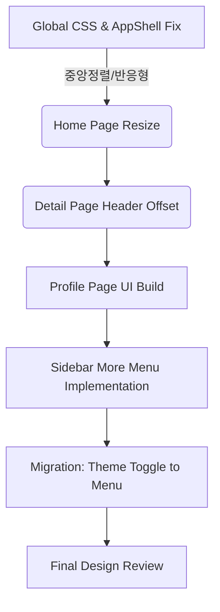

# [Step 8: UI 안정화, 프로필 구현 및 사이드바 고도화]

## 1. 개요 (Overview)

현재 KCL 애플리케이션은 7단계에서 도입된 **인스타그램 스타일의 구조(Global Sidebar)**와 기존의 콘텐츠가 충돌하며 **레이아웃 정렬 불량**, **반응형 미작동**, **헤더 겹침** 등의 치명적인 UI 문제가 발생하고 있습니다.
이번 단계의 최우선 목표는 **"깨진 UI를 완벽하게 수리(Fix & Polish)"** 하는 것입니다. 그 후, **로그인된 상태를 가정**한 **프로필 페이지**를 구현하고, 사이드바의 **'더 보기(More)'** 메뉴에 **다크모드 토글**과 **인증 상태별 분기** 기능을 탑재합니다.

---

## 2. 해결해야 할 UI 문제 (Critical Fixes)

### [Fix 1] 글로벌 레이아웃 중앙 정렬 및 반응형 복구

**현재 상황**: 앱 전체가 화면 중앙에 위치하지 않고 좌측이나 우측으로 치우쳐 있으며, 홈 화면의 콘텐츠가 모바일/데스크탑 변화에 따라 적절히 크기가 조절되지 않음.
**해결 방안**:

1.  **`AppShell` 구조 재정립**:
    - `main` 태그에 `margin-left: 244px` (Desktop) / `72px` (Tablet) / `0` (Mobile)을 적용하여 사이드바 공간을 확보합니다.
    - `main` 내부의 **Content Container**에 `max-width: 935px` (Instagram Standard) 및 `margin: 0 auto`를 강제 적용하여 모든 페이지가 화면 중앙에 오도록 합니다.
    - **`box-sizing: border-box`** 초기화가 전역적으로 올바르게 적용되었는지 점검합니다.

### [Fix 2] 홈 화면 반응형 처리 (Home Page Responsiveness)

**현재 상황**: 홈 화면의 카드나 피드가 화면 크기에 따라 잘리거나 깨짐.
**해결 방안**:

1.  **Grid System 도입**: 홈 화면의 콘텐츠(랭킹 카드 등)를 `CSS Grid` (minmax 활용) 또는 `Flex-wrap`으로 재구성합니다.
2.  **모바일 최적화**: 모바일(`width < 768px`)에서는 `1 column` 레이아웃으로 변경하고, 불필요한 여백(Padding)을 제거하여 화면을 넓게 씁니다.

### [Fix 3] 회사 상세 페이지 헤더 겹침 수정 (Detail Page Header)

**현재 상황**: `Sticky Header`가 콘텐츠 상단을 가리고 있어, 페이지 진입 시 제목이나 주요 정보가 잘림.
**해결 방안**:

1.  **Scroll Padding**: `html { scroll-padding-top: 60px; }` 등 전역 설정을 추가합니다.
2.  **Container offset**: 상세 페이지의 최상위 컨테이너에 `padding-top: var(--header-height)`를 명시적으로 부여하여 헤더 높이만큼 공간을 확보합니다. CSS 변수를 활용하여 헤더 높이 변경에 유연하게 대응합니다.

---

## 3. 신규 기능 구현 (New Features)

### [Feature 1] 프로필 페이지 (Profile Page) - 로그인 상태 가정

**목표**: `/profile` 경로 접근 시 로그인 페이지로 리다이렉트되던 것을 제거하고, **로그인이 완료된 사용자의 마이페이지**를 구현합니다.
**디자인 벤치마킹 (Instagram Profile)**:

1.  **상단 정보 (Profile Header)**:
    - **좌측**: 원형 프로필 이미지 (대형).
    - **우측**: 사용자 아이디(Username), 프로필 편집 버튼, 설정(톱니바퀴) 아이콘.
    - **통계**: 게시물 수, 팔로워, 팔로잉 숫자 표시 (Flex Row).
    - **소개**: 실명 및 자기소개 텍스트.
2.  **콘텐츠 탭 (Tabs)**:
    - [게시물] / [저장됨] / [태그됨] 3개의 탭 메뉴 (아이콘 + 텍스트).
    - 활성화된 탭 상단에 굵은 Border 표시 (`border-top: 1px solid white`).
3.  **게시물 그리드 (Post Grid)**:
    - `3-column` 정사각형 그리드 레이아웃.
    - 이미지 호버 시 어두운 오버레이와 함께 '좋아요 수', '댓글 수' 아이콘 표시.

### [Feature 2] 사이드바 '더 보기' 메뉴 (More Menu)

**목표**: 사이드바 하단의 **'더 보기(단선 3개 아이콘)'** 클릭 시 **Dropdown Menu**를 띄우고, 여기에 인증 상태 및 테마 설정을 통합합니다.
**기능 명세**:

1.  **Dropdown UI**:
    - 클릭 시 버튼 위쪽으로 팝업 메뉴가 나타남 (`Radix UI Popover` 또는 커스텀 구현).
    - 메뉴 스타일: 둥근 모서리, 글래스모피즘 배경, 섬세한 그림자.
2.  **메뉴 구성 (조건부 렌더링)**:
    - **공통**: `설정`, `내 활동`, `저장됨`, **`모드 전환 (다크/라이트)`**, `문제 신고`.
    - **로그인 상태**: 최하단에 **`로그아웃`** (빨간색 텍스트 권장).
    - **비로그인 상태**: 최하단에 **`로그인`** (강조된 텍스트).
3.  **기능 이관**:
    - 기존 **Header**에 있던 **다크/라이트 모드 토글** 기능을 이 메뉴의 `모드 전환` 항목으로 이동시킵니다.
    - 아이콘: 해(Light) / 달(Dark) 아이콘이 현재 상태에 따라 바뀝니다.

### [Feature 3] 헤더 정리 (Header Cleanup)

**목표**: 사이드바 도입에 따라 역할을 재정의합니다.

1.  **언어 선택 (Language)**:
    - 사용자 요청에 따라 **헤더(Header) 우측 상단**에 그대로 유지합니다.
    - 데스크탑에서는 메인 콘텐츠 영역 우측 상단에 `absolute` 또는 `fixed`로 배치될 수 있습니다. (사이드바와 겹치지 않도록 주의)

---

## 4. 기술적 요구사항 (Technical Requirements)

1.  **State Management**:
    - `useAuth` (가칭) 훅을 만들어 `isLoggedIn` 상태를 Mocking(기본값 `true`)하여 프로필 페이지와 더보기 메뉴를 테스트합니다.
2.  **Routing**:
    - `/profile` 경로를 `Authenticated Route`로 취급하되, 현재는 Mock 상태이므로 바로 렌더링합니다.
3.  **Responsiveness**:
    - 프로필 페이지의 3열 그리드는 모바일에서 간격을 좁히거나(`gap: 3px`) 유지하되, 헤더 정보 레이아웃은 모바일에서 세로형(이미지 상단, 통계 하단)으로 변형될 수 있음을 고려합니다.

---

## 5. 작업 순서 (Workflow)



## 6. 마스터 프롬프트 (Execution Prompt)

```markdown
# Phase 8: UI Stabilization & Profile & Sidebar Expansion

**목표**: 인스타그램 벤치마킹 UI의 완성도를 높이기 위해 틀어진 레이아웃을 전면 수정하고, 로그인된 사용자를 위한 프로필 페이지와 고도화된 사이드바 메뉴를 구현하십시오.

### 1단계: 글로벌 레이아웃 및 홈화면 수리 (Priority)

- [ ] **AppShell**: `main` 영역에 `margin: 0 auto`와 `max-width: 935px`를 적용하여 모든 콘텐츠를 화면 정중앙에 배치하십시오. 사이드바 너비(`72px`/`244px`)만큼의 `margin-left`가 선행되어야 합니다.
- [ ] **Home Page**: 그리드 시스템을 정비하여 모바일(`viewport < 768px`)과 데스크탑에서 카드가 깨지지 않고 유연하게 늘어나도록 수정하십시오.
- [ ] **Detail Page**: 상단 `Sticky Header`에 가려지는 콘텐츠가 없도록 `Container`에 `padding-top`을 추가하십시오.

### 2단계: 프로필 페이지 (Profile)

- [ ] **Route**: `/profile` 페이지를 새로 생성하십시오. (기존 리다이렉트 제거)
- [ ] **Layout**:
  - Top: 프로필 사진, 통계(게시물/팔로워/팔로잉), 바이오.
  - Bottom: 탭(게시물/저장됨/태그됨), 3열 이미지 그리드.
- [ ] **State**: 로그인된 상태를 가정하고 더미 데이터를 사용하여 풍성하게 채우십시오.

### 3단계: 사이드바 '더 보기' & 기능 이관

- [ ] **More Menu**: 사이드바 하단 '더 보기' 아이콘 클릭 시 나타나는 **팝업 메뉴**를 구현하십시오.
- [ ] **Theme Toggle**: 기존 헤더에 있던 다크모드/라이트모드 토글 버튼을 이 메뉴 내부의 "모드 전환" 항목으로 옮기십시오.
- [ ] **Language Selector**: 언어 선택 기능은 **헤더(상단)**에 그대로 유지하십시오. (위치 간섭 없도록 조정)
- [ ] **Menu Logic**: `isLoggedIn` 상태(Mock)에 따라 메뉴 최하단이 '로그인' 또는 '로그아웃'으로 바뀌도록 구현하십시오.

**주의사항**:

- 모든 디자인은 **KCL의 Dark & Neon** 무드를 유지해야 합니다.
- 수정 사항은 즉시 브라우저에서 확인 가능하도록 컴파일 에러 없이 작성하십시오.
```
