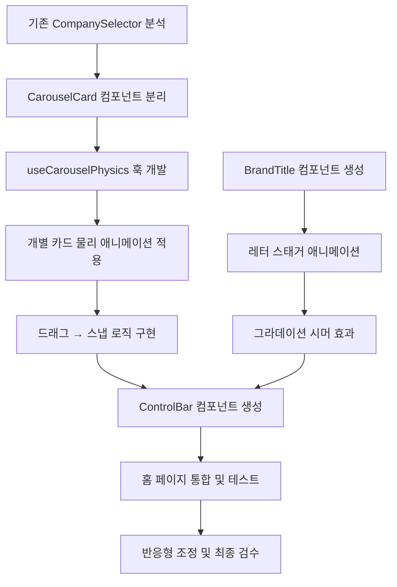

# [Step 9: 홈 화면 UX 혁신 및 캐러셀 인터랙션 고도화]

## 1. 개요 (Overview)

8단계에서 전체적인 레이아웃 안정화와 반응형 디자인을 완료했습니다. 이번 9단계에서는 **홈 화면의 핵심 경험인 회사 선택 캐러셀**을 물리 기반의 자연스러운 애니메이션으로 완전히 재설계하고, **브랜드 아이덴티티 강화**를 위한 타이틀 디자인 개선을 진행합니다.

현재 캐러셀의 문제점은 드래그 시 **모든 카드가 담긴 컨테이너 전체가 움직이는** 단순한 구조로 되어 있어, 사용자에게 "개별 카드를 선택한다"는 느낌보다 "스크롤한다"는 느낌을 줍니다. 이를 **각 카드가 독립적인 오브젝트로 물리적으로 반응하는** 인터랙션으로 개선하여, 마치 카드를 손으로 넘기는 듯한 촉각적(Tactile) 경험을 제공합니다.

---

## 2. 핵심 목표 (Key Objectives)

### 2.1 캐러셀 애니메이션 혁신 (Priority: Critical)

- **Before**: 컨테이너(`viewport`) 전체가 드래그 방향으로 이동
- **After**: 개별 카드가 각각의 위치, 스케일, 회전, 투명도를 가지고 물리 기반으로 이동

### 2.2 브랜드 타이틀 디자인 (Priority: High)

- "KCL" 약어를 "Kpop Company League"로 풀어서 프리미엄하게 표현
- 타이포그래피, 그라데이션, 마이크로 애니메이션 적용

### 2.3 컨트롤 UI 개선 (Priority: Medium)

- 좌우 화살표 버튼을 카드 하단으로 이동
- 페이지네이션 인디케이터와 통합된 깔끔한 네비게이션 바 디자인

---

## 3. 캐러셀 애니메이션 상세 설계 (Carousel Animation Specification)

### 3.1 현재 문제점 분석

```
현재 구조:
[viewport] ─── 드래그 시 전체가 x축으로 이동
  ├── [cardWrapper] ─── animate로 개별 위치 조정
  ├── [cardWrapper]
  └── [cardWrapper]

문제:
1. viewport 자체에 drag를 걸어서 전체가 움직임
2. 개별 카드의 animate는 index 변경 시에만 작동
3. 드래그 중간 상태에서 카드가 손가락을 따라오지 않음
```

### 3.2 목표 구조 설계

```
개선된 구조:
[carouselContainer] ─── 드래그 이벤트 감지만 담당
  ├── [card-1] ─── 개별적으로 x, scale, rotateY, opacity 계산
  ├── [card-2] ─── dragX 모션 값에 따라 실시간 변환
  ├── [card-3] ─── 중앙 카드는 scale(1.15), 양옆은 점진적 축소
  ├── [card-4]
  └── [card-5]

핵심 변경:
1. dragX 모션 값을 useMotionValue로 추적
2. 각 카드가 dragX 값을 기반으로 자신의 위치를 실시간 계산
3. useTransform으로 dragX → 각 카드의 x, scale, opacity 매핑
4. 드래그 release 시 스프링 애니메이션으로 가장 가까운 카드로 스냅
```

### 3.3 물리 기반 애니메이션 파라미터

| 속성       | 중앙 카드 | 1칸 옆 | 2칸 옆 | 화면 밖 |
| ---------- | --------- | ------ | ------ | ------- |
| scale      | 1.15      | 0.85   | 0.65   | 0.5     |
| opacity    | 1.0       | 0.8    | 0.5    | 0.2     |
| rotateY    | 0°        | ±25°   | ±40°   | ±50°    |
| translateX | 0         | ±180px | ±320px | ±450px  |
| z-index    | 10        | 8      | 6      | 4       |
| blur       | 0px       | 1px    | 3px    | 5px     |

### 3.4 드래그 인터랙션 상세

```typescript
// 드래그 제스처 설정
const dragConfig = {
  // 드래그 임계값: 이 이상 드래그해야 다음 카드로 이동
  swipeThreshold: 80, // px

  // 드래그 속도 임계값: 빠르게 스와이프하면 적은 거리로도 이동
  velocityThreshold: 500, // px/s

  // 스프링 설정: 카드가 제자리로 돌아오는 애니메이션
  spring: {
    type: 'spring',
    stiffness: 400,
    damping: 35,
    mass: 0.8,
  },

  // 탄성 효과: 끝에서 드래그 시 저항감
  elasticity: 0.3,
};
```

### 3.5 터치/마우스 피드백

- **드래그 시작**: 선택된 카드에 미세한 그림자 확대 (`box-shadow` 강화)
- **드래그 중**: 카드가 손가락/커서 위치를 실시간으로 추종
- **스냅 완료**: 햅틱 피드백 트리거 (모바일), 미세한 바운스 효과
- **카드 클릭**: 비중앙 카드 클릭 시 해당 카드로 부드럽게 이동

---

## 4. 브랜드 타이틀 디자인 상세 (Brand Title Specification)

### 4.1 현재 vs 목표

| 항목       | 현재                             | 목표                      |
| ---------- | -------------------------------- | ------------------------- |
| 텍스트     | "KCL"                            | "Kpop Company League"     |
| 스타일     | 단순 그라데이션                  | 프리미엄 타이포그래피     |
| 애니메이션 | 없음                             | 등장 시 스태거 애니메이션 |
| 서브타이틀 | "Choose & Support Your Favorite" | 동일 또는 개선된 문구     |

### 4.2 타이포그래피 설계

```scss
// 메인 타이틀: "Kpop Company League"
.mainTitle {
  // 폰트 설정
  font-family: var(--font-montserrat), sans-serif;
  font-weight: 900;
  text-transform: uppercase;
  letter-spacing: 0.15em;

  // 크기 (반응형)
  font-size: clamp(1.5rem, 5vw, 3rem);

  // 그라데이션 텍스트
  background: linear-gradient(
    135deg,
    #a855f7 0%,
    // 바이올렛
    #ec4899 25%,
    // 핑크
    #f59e0b 50%,
    // 앰버(골드)
    #ec4899 75%,
    // 핑크
    #a855f7 100% // 바이올렛
  );
  background-size: 200% auto;
  -webkit-background-clip: text;
  -webkit-text-fill-color: transparent;

  // 빛나는 효과 애니메이션
  animation: shimmer 3s linear infinite;
}

@keyframes shimmer {
  0% {
    background-position: 0% center;
  }
  100% {
    background-position: 200% center;
  }
}
```

### 4.3 레이아웃 옵션

**옵션 A: 3줄 스택 (권장)**

```
      KPOP
    COMPANY
     LEAGUE
```

- 각 단어가 세로로 쌓이며, 가운데 정렬
- "COMPANY"가 가장 강조 (가장 큰 폰트 또는 다른 색상)

**옵션 B: 1줄 가로**

```
KPOP COMPANY LEAGUE
```

- 한 줄로 표시, 글자 간격(letter-spacing)으로 시원한 느낌

**옵션 C: 하이브리드**

```
      KPOP
 COMPANY LEAGUE
```

- 첫 줄에 "KPOP", 두 번째 줄에 "COMPANY LEAGUE"

### 4.4 등장 애니메이션

```typescript
// Framer Motion을 활용한 스태거 애니메이션
const titleVariants = {
  hidden: {},
  visible: {
    transition: {
      staggerChildren: 0.08, // 각 글자가 0.08초 간격으로 등장
      delayChildren: 0.2,
    },
  },
};

const letterVariants = {
  hidden: {
    opacity: 0,
    y: 50,
    rotateX: -90,
  },
  visible: {
    opacity: 1,
    y: 0,
    rotateX: 0,
    transition: {
      type: 'spring',
      stiffness: 200,
      damping: 20,
    },
  },
};
```

---

## 5. 컨트롤 UI 개선 (Control UI Enhancement)

### 5.1 화살표 버튼 리포지셔닝

**현재**: 캐러셀 하단 중앙, 카드와 근접
**개선**: 캐러셀 영역 아래, 독립적인 컨트롤 바로 분리

```
┌─────────────────────────────────────┐
│                                     │
│        [카드 캐러셀 영역]            │
│    ←◯◯●◯◯→                         │
│                                     │
├─────────────────────────────────────┤
│                                     │
│        [투표 버튼 영역]              │
│                                     │
│       [View Full Ranking]           │
└─────────────────────────────────────┘

        ↓ 개선 후 ↓

┌─────────────────────────────────────┐
│                                     │
│        [카드 캐러셀 영역]            │
│                                     │
├─────────────────────────────────────┤
│      ←    ◯◯●◯◯    →               │  ← 컨트롤 바
├─────────────────────────────────────┤
│                                     │
│        [투표 버튼 영역]              │
│                                     │
│       [View Full Ranking]           │
└─────────────────────────────────────┘
```

### 5.2 컨트롤 바 디자인

```scss
.controlBar {
  display: flex;
  align-items: center;
  justify-content: center;
  gap: 24px;
  padding: 16px 0;
  margin-top: 24px;
}

.arrowButton {
  width: 44px;
  height: 44px;
  border-radius: 50%;
  background: rgba(255, 255, 255, 0.08);
  border: 1px solid rgba(255, 255, 255, 0.15);
  color: rgba(255, 255, 255, 0.7);

  display: flex;
  align-items: center;
  justify-content: center;

  transition: all 0.2s ease;

  &:hover {
    background: rgba(255, 255, 255, 0.15);
    color: #fff;
    transform: scale(1.1);
  }

  &:active {
    transform: scale(0.95);
  }
}

.pagination {
  display: flex;
  gap: 8px;

  .dot {
    width: 8px;
    height: 8px;
    border-radius: 50%;
    background: rgba(255, 255, 255, 0.3);
    transition: all 0.3s ease;

    &.active {
      width: 24px;
      border-radius: 4px;
      background: var(--color-primary);
    }
  }
}
```

---

## 6. 추가 개선 아이디어 (Bonus Enhancements)

### 6.1 파티클 배경 효과

- 홈 화면 배경에 미세한 별/파티클이 천천히 떠다니는 효과
- 투표 성공 시 파티클이 버스트되는 시각적 피드백

### 6.2 회사 카드 글라스모피즘 강화

- 카드 배경에 블러 + 그라데이션 보더 적용
- 호버/선택 시 글로우 효과 강화

### 6.3 실시간 투표 카운터 애니메이션

- 투표 수가 증가할 때 숫자가 롤링되는 애니메이션
- 오도미터(Odometer) 스타일 카운터

### 6.4 사운드 피드백 (선택적)

- 카드 스와이프 시 "휙" 효과음
- 투표 성공 시 "띵!" 효과음
- (기본적으로는 OFF, 설정에서 ON 가능)

### 6.5 키보드 접근성

- 좌우 화살표 키로 카드 네비게이션
- Enter/Space로 중앙 카드 투표
- Tab으로 포커스 이동

---

## 7. 기술적 구현 가이드 (Technical Implementation)

### 7.1 Framer Motion 활용 포인트

```typescript
// 핵심 훅 및 함수
import {
  motion,
  useMotionValue,
  useTransform,
  useAnimation,
  useDragControls,
  AnimatePresence,
} from 'framer-motion';

// 드래그 X 위치 추적
const dragX = useMotionValue(0);

// 각 카드별 변환 계산
const getCardTransform = (cardIndex: number, currentIndex: number) => {
  const offset = cardIndex - currentIndex;

  return {
    x: useTransform(dragX, [-300, 0, 300], [(offset - 1) * 180, offset * 180, (offset + 1) * 180]),
    scale: useTransform(
      dragX,
      [-300, 0, 300],
      [getScale(offset - 1), getScale(offset), getScale(offset + 1)],
    ),
    // ... opacity, rotateY 등
  };
};
```

### 7.2 성능 최적화

- **will-change**: 애니메이션되는 속성에 미리 선언
- **GPU 가속**: transform, opacity만 사용 (layout 트리거 방지)
- **메모이제이션**: 카드 컴포넌트를 React.memo로 래핑
- **레이지 로딩**: 화면 밖 카드는 간소화된 버전 렌더링

### 7.3 파일 구조

```
components/features/home/
├── CompanyCarousel/
│   ├── index.tsx              # 메인 캐러셀 컴포넌트
│   ├── CompanyCarousel.module.scss
│   ├── CarouselCard.tsx       # 개별 카드 컴포넌트
│   ├── ControlBar.tsx         # 화살표 + 페이지네이션
│   └── useCarouselPhysics.ts  # 물리 애니메이션 훅
├── BrandTitle/
│   ├── index.tsx              # 브랜드 타이틀 컴포넌트
│   └── BrandTitle.module.scss
└── VoteButton/
    └── (기존 유지)
```

---

## 8. 작업 순서 (Workflow)



---

## 9. 마스터 프롬프트 (Execution Prompt)

```markdown
# Phase 9: 홈 화면 UX 혁신 및 캐러셀 인터랙션 고도화

**목표**: 홈 화면의 회사 선택 캐러셀을 물리 기반 개별 카드 애니메이션으로 완전히 재설계하고,
브랜드 타이틀을 "Kpop Company League"로 풀어서 프리미엄하게 재디자인하십시오.

## 1단계: 캐러셀 애니메이션 혁신

- [ ] **구조 변경**: `viewport` 드래그 → 개별 카드 transform 방식으로 전환
- [ ] **useMotionValue**: `dragX` 값을 추적하여 각 카드가 실시간으로 반응하도록 구현
- [ ] **카드별 변환**: 중앙 카드는 `scale(1.15)`, 양옆은 점진적 축소, 회전, 투명도 적용
- [ ] **스냅 효과**: 드래그 release 시 가장 가까운 카드로 스프링 애니메이션 스냅
- [ ] **터치 피드백**: 드래그 중 카드 그림자 강화, 스냅 완료 시 미세한 바운스

## 2단계: 브랜드 타이틀 재디자인

- [ ] **BrandTitle 컴포넌트**: "KPOP COMPANY LEAGUE"를 3줄 스택 또는 1줄 레이아웃으로 구현
- [ ] **그라데이션 텍스트**: 바이올렛 → 핑크 → 골드 → 핑크 → 바이올렛 순환
- [ ] **시머 애니메이션**: 그라데이션이 천천히 흐르는 빛나는 효과
- [ ] **등장 애니메이션**: 각 글자가 스태거 방식으로 튀어오르며 등장

## 3단계: 컨트롤 UI 재배치

- [ ] **ControlBar 컴포넌트**: 화살표 버튼과 페이지네이션을 캐러셀 아래로 분리
- [ ] **화살표 디자인**: 원형 버튼, 호버 시 확대 효과
- [ ] **페이지네이션**: 활성 도트는 가로로 늘어나는 "pill" 형태

## 4단계: 통합 및 검증

- [ ] **홈 페이지 통합**: page.tsx에서 새 컴포넌트들을 조합
- [ ] **반응형 테스트**: 모바일, 태블릿, 데스크탑에서 모두 정상 작동 확인
- [ ] **성능 검증**: 60fps 유지, 끊김 없는 애니메이션

---

**주의사항**:

- 기존 VoteButton, SupportModal 등의 기능은 그대로 유지
- 키보드 접근성(좌우 화살표, Enter) 고려
- 다크 모드 호환성 유지
- 모든 코드에 한국어 주석 작성
```

---

## 10. 예상 결과물 (Expected Outcome)

### Before

- 컨테이너 전체가 움직이는 단순한 캐러셀
- "KCL" 3글자 약어
- 카드와 붙어있는 좌우 버튼

### After

- 개별 카드가 물리적으로 반응하는 프리미엄 캐러셀
- "KPOP COMPANY LEAGUE" 풀 브랜딩 + 시머 효과
- 독립된 컨트롤 바 (화살표 + 페이지네이션)
- 전체적으로 "앱스토어 피처드 앱" 수준의 완성도
