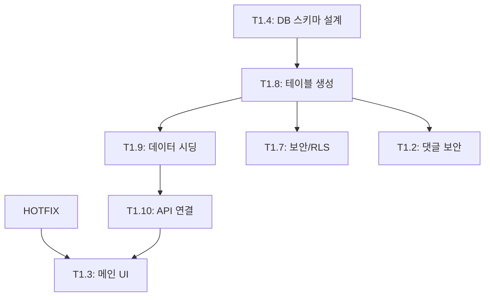

# TASKS: PLOLUX Workspace - AI 개발 파트너용 태스크 목록

## MVP 캡슐 (1차 개발 목표)

1. **목표**: **KCL 단독** 비로그인 기반 랭킹/투표 시스템 구축 (초기 트래픽 확보 최우선)
2. **Phase 1 전략**:
   - 회원가입/결제 시스템 **제외**
   - 익명 투표 및 댓글 활성화
   - 광고 지면(구글 애드센스 등) 공간 확보
3. **핵심 기능**:
   - 12개 언어 지원 Global Ranking
   - 회사 상세 페이지 및 투표 기능
   - 안정적인 DB 스키마 설계 (Supabase)

---

## 마일스톤 개요

| 마일스톤 | 설명                | 주요 기능                 | 전략   |
| -------- | ------------------- | ------------------------- | ------ |
| M0       | 프로젝트 셋업       | Phase 0 (기본 구조)       | 완료   |
| M1       | KCL 1차 오픈        | Phase 1 (랭킹, 익명 투표) | 진행중 |
| M2       | KCL 고도화 (Future) | Phase 2 (로그인, 결제)    | 보류   |

---

## M0: 프로젝트 셋업 (완료)

### ✅ Phase 0, T0.1: 모노레포 구조 초기화

**담당**: Max (Backend)
**상태**: 완료

### ✅ Phase 0, T0.2: CI/CD 파이프라인 구축

**담당**: Max (Backend)
**상태**: 완료

(T0.3 Supabase 연동은 Mock Data 사용 중이므로 Phase 1에 통합)

---

## M1: KCL 1차 오픈 (진행중)

### ✅ [HOTFIX] 헤더 중복 노출 수정

**담당**: Viper (Security & Full-Stack)

**우선순위**: Critical
**증상**: `/company/[id]` 및 `/support` 페이지에서 헤더가 2개씩 노출됨
**해결**: 중복 컴포넌트 제거 및 레이아웃 정리
**완료일**: 2026-01-12
**커밋**: b8228f1

---

### ✅ Phase 1, T1.4: 데이터베이스 스키마 설계

**담당**: Max (Backend)
**상태**: ✅ 완료
**완료일**: 2026-01-12
**커밋**: 1a5b1e6

**목적**: KCL 서비스의 데이터 구조를 설계하고 문서화 (실제 테이블 생성은 T1.8에서 수행)

**전략**:

- ✅ **기존 Supabase 프로젝트 활용** (신규 프로젝트 생성 안함)
- 테이블명 규칙: `kcl_` 접두사 필수 (네임스페이스 분리)
- Mock Data는 Phase 1B 완료 전까지 계속 사용

**작업 내용**:

1. **Supabase 연결 확인**:
   - 환경 변수 검증: `NEXT_PUBLIC_SUPABASE_URL`, `NEXT_PUBLIC_SUPABASE_ANON_KEY`
   - `lib/supabase/client.ts` 클라이언트 초기화 코드 검증

2. **DB 스키마 설계 및 문서화** (⭐ 핵심 작업):
   - `doc/project/kcl/schema.md`에 ERD 및 테이블 명세 작성
   - 핵심 엔티티 설계:
     - `kcl_companies`: 소속사 정보 (id, name, logo_url, description, created_at 등)
     - `kcl_groups`: 아티스트 정보 (id, name, company_id, debut_date, member_count 등)
     - `kcl_votes`: 투표 내역 (id, company_id, group_id, ip_hash, created_at 등)
     - `kcl_comments`: 댓글 시스템 (선택적)
   - **관계 설계**: Group(N) - Company(1), Vote(N) - Company(1), Vote(N) - Group(1)
   - 인덱스 전략, 제약 조건(Constraints), RLS 정책 설계

3. **Migration SQL 작성** (실행 X, 문서화만):
   - `doc/project/kcl/migrations/001_create_tables.sql` 작성
   - 테이블 생성 DDL (CREATE TABLE)
   - 인덱스 생성 (CREATE INDEX)
   - RLS 정책 템플릿 (익명 투표 허용, Rate Limit 고려)

**제외 항목** (별도 태스크로 분리):

- ❌ 실제 테이블 생성 → T1.8로 이관
- ❌ 데이터 시딩 → T1.9로 이관
- ❌ API 로직 연결 → T1.10으로 이관

**산출물**:

- `doc/project/kcl/schema.md` (ERD + 테이블 명세)
- `doc/project/kcl/migrations/001_create_tables.sql` (실행 대기)

---

### [] Phase 1, T1.8: 데이터베이스 테이블 생성 (추후)

**담당**: Max (Backend)
**의존성**: T1.4 완료 후

**작업 내용**:

- T1.4에서 작성한 Migration SQL 실행
- Supabase Studio에서 테이블 생성 확인
- RLS 정책 활성화 및 테스트

---

### [] Phase 1, T1.9: 초기 데이터 시딩 (추후)

**담당**: Max (Backend)
**의존성**: T1.8 완료 후

**작업 내용**:

- `kcl_companies`: 기존 Mock Data 마이그레이션
- `kcl_groups`: 주요 K-POP 아티스트 50~100팀 데이터 Insert
- Seed SQL 파일 작성 및 실행

---

### [] Phase 1, T1.10: API 로직 DB 연결 (추후)

**담당**: Max (Backend) + Luna (Frontend)
**의존성**: T1.9 완료 후

**작업 내용**:

- 프론트엔드에서 Mock API 호출 → Supabase Query로 교체
- 실시간 랭킹 업데이트 로직 구현
- 투표 API 엔드포인트 구현

---

### ✅ Phase 1, T1.5: 다국어(i18n) 시스템 구축

**담당**: Luna (Frontend)
**상태**: ✅ 완료
**완료일**: 2026-01-12
**커밋**: 2019043

**목표**: 12개 언어 지원을 위한 `next-intl` 환경 완벽 구축

**지원 언어**:

- `ko` (한국어), `en` (English)
- `id` (Bahasa Indonesia), `tr` (Türkçe)
- `ja` (日本語), `zh` (中文-简体)
- `es` (Español), `pt` (Português)
- `th` (ภาษาไทย), `vi` (Tiếng Việt)
- `fr` (Français), `de` (Deutsch)

**작업 내용**:

1. **설정 파일 점검**: `i18n/request.ts`, `middleware.ts` 라우팅 설정 확인
2. **번역 파일 생성**: `messages/{locale}.json` 12개 파일 생성 (기본값 English 복제)
3. **UI 언어 변경 기능**: 헤더/푸터에 언어 선택 드롭다운(Select) 구현
4. **메타데이터 번역**: `layout.tsx`의 Title, Description 동적 처리

**산출물**:

- `packages/kcl/messages/*.json` (12개)
- `packages/kcl/src/middleware.ts`

---

### ✅ Phase 1, T1.1 & T1.3: 통합 메인 대시보드 구축 (UI 전면 개편)

**담당**: Luna (Frontend)
**상태**: ✅ 완료
**완료일**: 2026-01-14
**배포**: 완료 (Commit ab65080)

**목표**: 홈 화면과 랭킹 페이지를 통합하여 **투표와 순위 확인이 한 곳에서 이루어지는 단일 대시보드** 구현.

**구현 완료 내용**:

1.  **레이아웃 재구축 (`app/[locale]/page.tsx`)**:
    - ✅ 기존 `CompanySelector` 제거 → **Ranking List** 기반으로 변경
    - ✅ **Sticky Search Bar** 구현: 상단 고정, **아티스트/소속사 통합 검색** 및 자동완성
    - ✅ **반응형 컨테이너**: Mobile (List + BottomSheet) / Desktop (65% List + 35% StickyPanel)

2.  **투표 인터페이스 모듈화**:
    - ✅ `VoteController` 컴포넌트 개발
    - ✅ **Mobile**: `BottomSheet` 하단 슬라이드
    - ✅ **Desktop**: 우측 `StickyPanel` 고정

3.  **인터랙션 구현**:
    - ✅ **Split Action UI**: 본문=Vote / Chevron=상세 이동
    - ✅ **Artist Chips**: 아티스트 선택 UI
    - ✅ **Auto-Scroll & Highlight**: 검색 시 해당 아이템으로 스크롤 및 강조
    - ✅ 기존 `canvas-confetti` 재활용 (투표 파티클 효과)

**산출물**:

- `packages/kcl/src/components/ui/BottomSheet/`
- `packages/kcl/src/components/ui/StickyPanel/`
- `packages/kcl/src/components/ui/SearchBar/`
- `packages/kcl/src/components/features/VoteController/`
- `packages/kcl/src/components/features/dashboard/DashboardRankingItem/`

**인수 조건**:

- [x] 모바일에서 리스트 클릭 시 보텀시트가 자연스럽게 올라오는가? ✅
- [x] PC에서 우측 패널이 스크롤과 무관하게 고정되어 있는가? ✅
- [x] 검색 시 해당 회사 위치로 정확히 스크롤되고 강조되는가? ✅

**비고**: 배포 완료

---

### ✅ Phase 1, T1.6: 네비게이션 및 메뉴 재구성

**담당**: Kai (Full-Stack)
**상태**: ✅ 완료
**완료일**: 2026-01-14
**커밋**: aafcb74
**배포**: GitHub Pages 배포 완료

**목표**: 1차 개발 범위에 맞춰 메뉴를 최적화하고 PC/Mobile 경험 통일 (통합 대시보드 반영)

**Viper 보안 점검 결과**:

- 🟢 Critical 이슈: 0건
- 🟠 Warning: 4건 (i18n 미적용 - 작업 시 함께 수정)
- 권고: `useTranslations('Nav')` 적용, 새 번역 키 추가 필요

**작업 내용**:

- **PC (Sidebar) & Mobile (BottomNav) 통일**:
  1.  **홈 (Home)**: 통합 대시보드 (랭킹+투표)
  2.  **모드 전환 (Theme Toggle)**: 기존 '더보기'에서 밖으로 꺼냄
  3.  **문제 신고 (Report)**: 버그 제보/문의 링크
- **제외 항목 (메뉴에서 숨김)**:
  - ~~랭킹 (Ranking)~~: 홈으로 통합됨
  - 프로필 (My), 만들기 (Create), 서포트 (Support)
  - _페이지 파일은 Phase 2를 위해 유지_

**산출물**:

- `packages/kcl/src/components/layout/Sidebar/Sidebar.tsx`
- `packages/kcl/src/components/layout/BottomNav/BottomNav.tsx`

---

### [] Phase 1, T1.7: 보안 정책 및 법적 고지 적용

**담당**: Viper (Security)

**목표**: DB 보안(RLS) 및 법적 리스크 방어 장치(Disclaimer) 구현 (독립 브랜치 작업)

**작업 내용**:

1.  **DB 보안 (RLS)**:
    - `votes` 테이블: 익명 INSERT 허용, UPDATE/DELETE 차단 정책 SQL 작성
2.  **법적 고지 (Disclaimer)**:
    - 공통 컴포넌트 `DisclaimerBanner` 개발 ("Unofficial Fan App" 명시)
    - 사이드바/푸터에 해당 컴포넌트 배치
3.  **이용약관/개인정보처리방침**:
    - `/terms`, `/privacy` 페이지 껍데기 생성 (Phase 2 상세화 전 기본 고지)

**산출물**:

- `packages/kcl/supabase/policies.sql`
- `packages/kcl/src/components/common/DisclaimerBanner.tsx`

---

### [] Phase 1, T1.2: 댓글 시스템 보안 강화

**담당**: Viper (Security)
**상태**: 대기

---

## 의존성 그래프

---

**마지막 업데이트**: 2026-01-13 (T1.1 & T1.3 완료, T1.6 보안 점검 완료)
**다음 태스크**:

- 🔄 병합 대기: T1.1 & T1.3 통합 대시보드 (CEO 승인 필요)
- 🔄 구현 대기: T1.6 네비게이션 재구성 (Luna 배정)
- ⏸️ CEO 검토: T1.8 DB 테이블 생성 (스키마 검토 후 진행)
