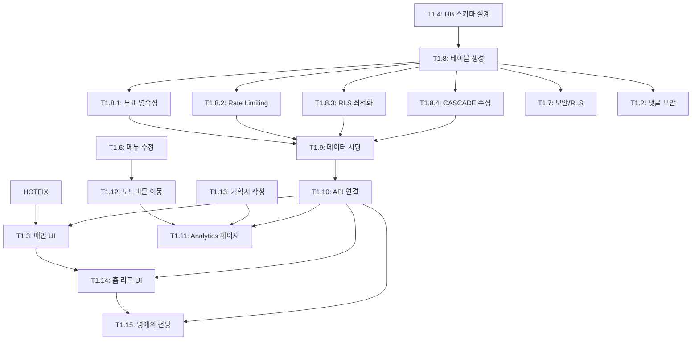

# TASKS: PLOLUX Workspace - AI 개발 파트너용 태스크 목록

## MVP 캡슐 (1차 개발 목표)

1. **목표**: **KCL 단독** 비로그인 기반 랭킹/투표 시스템 구축 (초기 트래픽 확보 최우선)
2. **Phase 1 전략**:
   - 회원가입/결제 시스템 **제외**
   - 익명 투표 및 댓글 활성화
   - 광고 지면(구글 애드센스 등) 공간 확보
3. **핵심 기능**:
   - 12개 언어 지원 Global Ranking
   - 회사 상세 페이지 및 투표 기능
   - 안정적인 DB 스키마 설계 (Supabase)

---

## 마일스톤 개요

| 마일스톤 | 설명                | 주요 기능                 | 전략   |
| -------- | ------------------- | ------------------------- | ------ |
| M0       | 프로젝트 셋업       | Phase 0 (기본 구조)       | 완료   |
| M1       | KCL 1차 오픈        | Phase 1 (랭킹, 익명 투표) | 진행중 |
| M2       | KCL 고도화 (Future) | Phase 2 (로그인, 결제)    | 보류   |

---

## M0: 프로젝트 셋업 (완료)

### ✅ Phase 0, T0.1: 모노레포 구조 초기화

**담당**: Max (Backend)
**상태**: 완료

### ✅ Phase 0, T0.2: CI/CD 파이프라인 구축

**담당**: Max (Backend)
**상태**: 완료

(T0.3 Supabase 연동은 Mock Data 사용 중이므로 Phase 1에 통합)

---

## M1: KCL 1차 오픈 (진행중)

### ✅ [HOTFIX] 헤더 중복 노출 수정

**담당**: Viper (Security & Full-Stack)

**우선순위**: Critical
**증상**: `/company/[id]` 및 `/support` 페이지에서 헤더가 2개씩 노출됨
**해결**: 중복 컴포넌트 제거 및 레이아웃 정리
**완료일**: 2026-01-12
**커밋**: b8228f1

---

### ✅ Phase 1, T1.4: 데이터베이스 스키마 설계

**담당**: Max (Backend)
**상태**: ✅ 완료
**완료일**: 2026-01-12
**커밋**: 1a5b1e6

**목적**: KCL 서비스의 데이터 구조를 설계하고 문서화 (실제 테이블 생성은 T1.8에서 수행)

**전략**:

- ✅ **기존 Supabase 프로젝트 활용** (신규 프로젝트 생성 안함)
- 테이블명 규칙: `kcl_` 접두사 필수 (네임스페이스 분리)
- Mock Data는 Phase 1B 완료 전까지 계속 사용

**작업 내용**:

1. **Supabase 연결 확인**:
   - 환경 변수 검증: `NEXT_PUBLIC_SUPABASE_URL`, `NEXT_PUBLIC_SUPABASE_ANON_KEY`
   - `lib/supabase/client.ts` 클라이언트 초기화 코드 검증

2. **DB 스키마 설계 및 문서화** (⭐ 핵심 작업):
   - `doc/project/kcl/schema.md`에 ERD 및 테이블 명세 작성
   - 핵심 엔티티 설계:
     - `kcl_companies`: 소속사 정보 (id, name, logo_url, description, created_at 등)
     - `kcl_groups`: 아티스트 정보 (id, name, company_id, debut_date, member_count 등)
     - `kcl_votes`: 투표 내역 (id, company_id, group_id, ip_hash, created_at 등)
     - `kcl_comments`: 댓글 시스템 (선택적)
   - **관계 설계**: Group(N) - Company(1), Vote(N) - Company(1), Vote(N) - Group(1)
   - 인덱스 전략, 제약 조건(Constraints), RLS 정책 설계

3. **Migration SQL 작성** (실행 X, 문서화만):
   - `doc/project/kcl/migrations/001_create_tables.sql` 작성
   - 테이블 생성 DDL (CREATE TABLE)
   - 인덱스 생성 (CREATE INDEX)
   - RLS 정책 템플릿 (익명 투표 허용, Rate Limit 고려)

**제외 항목** (별도 태스크로 분리):

- ❌ 실제 테이블 생성 → T1.8로 이관
- ❌ 데이터 시딩 → T1.9로 이관
- ❌ API 로직 연결 → T1.10으로 이관

**산출물**:

- `doc/project/kcl/schema.md` (ERD + 테이블 명세)
- `doc/project/kcl/migrations/001_create_tables.sql` (실행 대기)

---

### ✅ Phase 1, T1.8: 데이터베이스 테이블 생성

**담당**: Max (Backend)
**상태**: ✅ 완료
**완료일**: 2026-01-14
**Migration**: `001_kcl_create_tables`, `002_kcl_fix_function_search_path`

**작업 내용**:

- ✅ T1.4에서 작성한 Migration SQL 실행
- ✅ Supabase Studio에서 테이블 생성 확인
- ✅ RLS 정책 활성화 및 테스트

**생성된 테이블**:

- `kcl_companies` (소속사) - RLS ✅
- `kcl_groups` (아티스트) - RLS ✅
- `kcl_votes` (투표) - RLS ✅
- `kcl_comments` (댓글) - RLS ✅
- `kcl_users` (유저, Phase 2용) - RLS ✅

---

### 🔴 Phase 1, T1.8.1: [CRITICAL] 투표 데이터 영속성 구현

**담당**: Kai (Full-Stack)
**상태**: 대기
**의존성**: T1.8 완료 후
**우선순위**: 🔴 Critical (출시 전 필수)

**문제점**:
현재 투표가 Redis 카운터만 증가시키고 `kcl_votes` 테이블에 INSERT되지 않음.
서버 재시작 시 모든 투표 데이터 유실됨.

**해결책**: Vote Batcher 패턴 도입 (250개 배치 INSERT, 50x 성능 향상)

**작업 내용**:

1. `packages/kcl/src/lib/vote-batcher.ts` 신규 생성
   - 250개 투표마다 1회 배치 INSERT
   - 5초 간격 자동 flush
2. `batch_insert_votes` PostgreSQL 함수 추가 (unnest 활용)
3. `packages/kcl/src/app/api/vote/route.ts` 수정
   - Redis 증가 후 VoteBatcher 큐에 추가

**산출물**:

- `packages/kcl/src/lib/vote-batcher.ts`
- `doc/project/kcl/migrations/002_batch_insert_function.sql`

---

### 🔴 Phase 1, T1.8.2: [CRITICAL] Rate Limiting 구현

**담당**: Kai (Full-Stack)
**상태**: 대기
**의존성**: T1.8 완료 후
**우선순위**: 🔴 Critical (출시 전 필수)

**문제점**:
`ip_hash` 컬럼은 있으나 실제 Rate Limit 로직이 없음.
어뷰징(무한 투표) 방어 불가.

**해결책**: Sliding Window 알고리즘 (Cloudflare/Redis 표준)

**작업 내용**:

1. `packages/kcl/src/lib/rate-limit.ts` 신규 생성
   - Redis Sorted Set 활용
   - 1시간당 10회 투표 제한
2. Vote API에 Rate Limit 체크 통합
3. 429 Too Many Requests 응답 처리

**산출물**:

- `packages/kcl/src/lib/rate-limit.ts`

---

### 🔴 Phase 1, T1.8.3: [CRITICAL] RLS 정책 성능 최적화

**담당**: Max (Backend)
**상태**: 대기
**의존성**: T1.8 완료 후
**우선순위**: 🔴 Critical (출시 전 필수)

**문제점**:
현재 RLS 정책이 `USING (true)` 직접 사용 → 매 쿼리마다 재평가

**해결책**: SELECT 래핑으로 100배 성능 향상 (Supabase 공식 권장)

**작업 내용**:

1. 모든 RLS 정책 SELECT 래핑 적용
   - `USING (true)` → `USING ((SELECT true))`
   - `USING (auth.uid() = id)` → `USING ((SELECT auth.uid()) = id)`
2. RLS 컬럼에 인덱스 추가
   - `idx_votes_company_id`
   - `idx_comments_company_id`

**산출물**:

- `doc/project/kcl/migrations/003_optimize_rls.sql`

---

### 🔴 Phase 1, T1.8.4: [CRITICAL] CASCADE DELETE → RESTRICT 변경

**담당**: Max (Backend)
**상태**: 대기
**의존성**: T1.8 완료 후
**우선순위**: 🔴 Critical (출시 전 필수)

**문제점**:
현재 소속사 삭제 시 모든 투표/댓글이 자동 삭제됨 (CASCADE DELETE).
실수로 인한 대규모 데이터 손실 위험.

**해결책**: `ON DELETE RESTRICT`로 변경하여 참조 데이터 있을 시 삭제 차단

**작업 내용**:

1. Foreign Key 제약조건 수정
   - `kcl_votes.company_id`: CASCADE → RESTRICT
   - `kcl_comments.company_id`: CASCADE → RESTRICT
2. 삭제 전 참조 데이터 확인 로직 필요 시 Edge Function 추가

**산출물**:

- `doc/project/kcl/migrations/004_restrict_delete.sql`

---

### ✅ Phase 1, T1.9: 초기 데이터 시딩

**담당**: Max (Backend)
**상태**: ✅ 완료
**완료일**: 2026-01-14
**커밋**: `3510df1`
**브랜치**: `phase/1-data-seeding` (병합 대기)

**결과**:

| 항목                   | 목표  | 달성         |
| ---------------------- | ----- | ------------ |
| 소속사 (kcl_companies) | 20개+ | **30개** ✅  |
| 아티스트 (kcl_groups)  | 50팀+ | **105팀** ✅ |

**산출물**:

- `doc/project/kcl/migrations/002_seed_companies.sql`
- `doc/project/kcl/migrations/003_seed_groups.sql`

---

### [] Phase 1, T1.10: API 로직 DB 연결 (추후)

**담당**: Max (Backend) + Luna (Frontend)
**의존성**: T1.9 완료 후

**작업 내용**:

- 프론트엔드에서 Mock API 호출 → Supabase Query로 교체
- 실시간 랭킹 업데이트 로직 구현
- 투표 API 엔드포인트 구현

---

### ✅ Phase 1, T1.5: 다국어(i18n) 시스템 구축

**담당**: Luna (Frontend)
**상태**: ✅ 완료
**완료일**: 2026-01-12
**커밋**: 2019043

**목표**: 12개 언어 지원을 위한 `next-intl` 환경 완벽 구축

**지원 언어**:

- `ko` (한국어), `en` (English)
- `id` (Bahasa Indonesia), `tr` (Türkçe)
- `ja` (日本語), `zh` (中文-简体)
- `es` (Español), `pt` (Português)
- `th` (ภาษาไทย), `vi` (Tiếng Việt)
- `fr` (Français), `de` (Deutsch)

**작업 내용**:

1. **설정 파일 점검**: `i18n/request.ts`, `middleware.ts` 라우팅 설정 확인
2. **번역 파일 생성**: `messages/{locale}.json` 12개 파일 생성 (기본값 English 복제)
3. **UI 언어 변경 기능**: 헤더/푸터에 언어 선택 드롭다운(Select) 구현
4. **메타데이터 번역**: `layout.tsx`의 Title, Description 동적 처리

**산출물**:

- `packages/kcl/messages/*.json` (12개)
- `packages/kcl/src/middleware.ts`

---

### ✅ Phase 1, T1.1 & T1.3: 통합 메인 대시보드 구축 (UI 전면 개편)

**담당**: Luna (Frontend)
**상태**: ✅ 완료
**완료일**: 2026-01-14
**배포**: 완료 (Commit ab65080)

**목표**: 홈 화면과 랭킹 페이지를 통합하여 **투표와 순위 확인이 한 곳에서 이루어지는 단일 대시보드** 구현.

**구현 완료 내용**:

1.  **레이아웃 재구축 (`app/[locale]/page.tsx`)**:
    - ✅ 기존 `CompanySelector` 제거 → **Ranking List** 기반으로 변경
    - ✅ **Sticky Search Bar** 구현: 상단 고정, **아티스트/소속사 통합 검색** 및 자동완성
    - ✅ **반응형 컨테이너**: Mobile (List + BottomSheet) / Desktop (65% List + 35% StickyPanel)

2.  **투표 인터페이스 모듈화**:
    - ✅ `VoteController` 컴포넌트 개발
    - ✅ **Mobile**: `BottomSheet` 하단 슬라이드
    - ✅ **Desktop**: 우측 `StickyPanel` 고정

3.  **인터랙션 구현**:
    - ✅ **Split Action UI**: 본문=Vote / Chevron=상세 이동
    - ✅ **Artist Chips**: 아티스트 선택 UI
    - ✅ **Auto-Scroll & Highlight**: 검색 시 해당 아이템으로 스크롤 및 강조
    - ✅ 기존 `canvas-confetti` 재활용 (투표 파티클 효과)

**산출물**:

- `packages/kcl/src/components/ui/BottomSheet/`
- `packages/kcl/src/components/ui/StickyPanel/`
- `packages/kcl/src/components/ui/SearchBar/`
- `packages/kcl/src/components/features/VoteController/`
- `packages/kcl/src/components/features/dashboard/DashboardRankingItem/`

**인수 조건**:

- [x] 모바일에서 리스트 클릭 시 보텀시트가 자연스럽게 올라오는가? ✅
- [x] PC에서 우측 패널이 스크롤과 무관하게 고정되어 있는가? ✅
- [x] 검색 시 해당 회사 위치로 정확히 스크롤되고 강조되는가? ✅

**비고**: 배포 완료

---

### ✅ Phase 1, T1.6: 네비게이션 및 메뉴 재구성

**담당**: Kai (Full-Stack)
**상태**: 🔄 수정 필요
**완료일**: 2026-01-14
**커밋**: aafcb74

**목표**: 1차 개발 범위에 맞춰 메뉴를 최적화하고 PC/Mobile 경험 통일 (통합 대시보드 반영)

**⚠️ 수정 사항 (2026-01-14)**:

- `report` → `analytics` 라우트 변경 필요
- 메뉴명: "제보/문의" → "통계" 변경
- 404 오류 해결 필요 (페이지 미생성)

**최종 메뉴 구성**:

- **PC (Sidebar) & Mobile (BottomNav) 통일**:
  1.  **홈 (Home)**: 통합 대시보드 (랭킹+투표) - `/`
  2.  **통계 (Analytics)**: 투표 트렌드 및 분석 - `/analytics`
  3.  **더 보기 (More)**: 테마 전환, 설정 등
- **제외 항목 (메뉴에서 숨김)**:
  - ~~랭킹 (Ranking)~~: 홈으로 통합됨
  - 프로필 (My), 만들기 (Create), 서포트 (Support)
  - _페이지 파일은 Phase 2를 위해 유지_

**산출물**:

- `packages/kcl/src/components/layout/Sidebar/index.tsx`
- `packages/kcl/src/components/layout/BottomNav/index.tsx`

---

### ✅ Phase 1, T1.12: UI 개선 - 모드 전환 버튼 이동

**담당**: Luna (Frontend)
**상태**: ✅ 완료
**완료일**: 2026-01-14
**우선순위**: Medium
**분류**: 순수 UI 작업

**목표**: 사용자 접근성 향상을 위해 '모드 전환(다크/라이트)' 버튼을 더보기 메뉴에서 분리하여 상단 배치

**작업 내용**:

1. ✅ Sidebar/Header 영역에 모드 전환 토글 버튼 배치 (우측 상단)
2. ✅ MoreDropdown 내 모드 전환 항목 제거
3. ✅ 모바일/PC 반응형 위치 조정

**산출물**:

- `src/components/common/ThemeToggle/index.tsx` (신규)
- `src/components/common/ThemeToggle/ThemeToggle.module.scss` (신규)
- `src/components/layout/Sidebar/index.tsx` (수정)
- `src/components/layout/Header/index.tsx` (수정)
- `src/components/common/Dropdown/index.tsx` (수정)

---

### ✅ Phase 1, T1.13: 문서화 - Analytics(통계) 화면 기획서 작성

**담당**: Kai (Lead) + Luna (Support)
**상태**: ✅ 완료
**완료일**: 2026-01-14
**우선순위**: High
**후속 작업**: T1.11

**목표**: Analytics 페이지 개발 전 화면 구성 및 기능 명세 확정

**작업 분담**:

- **Kai (리드)**: 데이터 관점 기획, 차트별 필요 데이터 정의, API 스펙 초안
- **Luna (서포트)**: 화면 레이아웃, UX 흐름, 반응형 고려사항

**작업 내용**:

- ✅ `doc/project/kcl/analytics_screen_spec.md` 작성
- ✅ 실시간 트렌드, 점유율, 급상승 차트 등 주요 섹션 와이어프레임(텍스트 기반) 정의
- ✅ 데이터 요구사항 및 Mock 데이터 구조 정의

**기획서 포함 내용** (약 500줄, 15KB):

1. 개요 및 타겟 사용자
2. 화면 구성 (ASCII 와이어프레임)
3. 반응형 레이아웃 (Mobile/Tablet/Desktop)
4. 데이터 요구사항 (TypeScript 타입 정의)
5. Mock 데이터 구조
6. 기술 스택 (Recharts, SWR, nuqs)
7. 인터랙션 정의
8. 접근성 고려사항
9. i18n 메시지 키 정의
10. 컴포넌트 구조 및 인터페이스
11. 개발 우선순위 (Must/Should/Nice to Have)

**산출물**:

- `doc/project/kcl/analytics_screen_spec.md`

---

### [] Phase 1, T1.11: Analytics(통계) 페이지 구현

**담당**: Luna (Frontend) + Kai (Data Layer)
**상태**: 대기
**의존성**: T1.6 메뉴 수정 완료 후, T1.13 기획서 작성 후
**우선순위**: High

**목표**: 투표 데이터 기반의 시각화된 통계 및 트렌드 분석 페이지 구현

**라우트**: `/[locale]/analytics`

**UI 구성**:

1. **Header**: 기간 필터 (오늘/7일/30일/전체)
2. **Main Charts**:
   - 실시간 트렌드 차트 (시간대별/일별 투표 추이)
   - 소속사별 점유율 (Pie/Donut Chart)
   - 급상승 소속사 Top 5
   - 아티스트별 기여도 (소속사 내 비중)
3. **Footer**: 데이터 갱신 시간 표시

**기술 스택**:

- 차트: Recharts (React 친화적, 번들 경량)
- 데이터: Mock Data → 추후 Supabase 연동 (T1.10 이후)
- 캐싱: SWR 또는 React Query

**작업 분담**:

- **Luna**: UI/UX, 차트 컴포넌트, 반응형 레이아웃
- **Kai**: 데이터 페칭 로직, 타입 정의, API 연동 준비

**산출물**:

- `packages/kcl/src/app/[locale]/analytics/page.tsx`
- `packages/kcl/src/components/features/analytics/` (차트 컴포넌트들)
- `packages/kcl/src/messages/*.json` Nav.analytics 키 추가 (12개 언어)

**인수 조건**:

- [ ] `/analytics` 라우트 정상 접근 (404 해결)
- [ ] 최소 2개 이상의 차트 표시
- [ ] 반응형 (Mobile/Desktop) 정상 작동
- [ ] 12개 언어 메뉴명 적용

---

### ✅ Phase 1, T1.14: 홈 화면 리그 시스템 UI 개편 (탭 기반)

**담당**: Luna (Frontend)
**상태**: ✅ 완료
**완료일**: 2026-01-14
**커밋**: `f7cfd83`
**브랜치**: `phase/1-league-ui` (병합 대기)
**기획서**: `doc/project/kcl/home_league_spec.md`

**결과**:

| 항목      | 내용                                               |
| --------- | -------------------------------------------------- |
| 컴포넌트  | 7개 (SeasonHeader, LeagueTabs, PromotionBattle 등) |
| i18n      | 12개 언어 완료                                     |
| 파일 수정 | 29개                                               |

**생성된 컴포넌트**:

- `SeasonHeader` - 시즌 정보 헤더 (D-day, 현재 1위)
- `LeagueTabs` - 1부/2부 리그 탭 (스와이프 지원)
- `PromotionBattle` - 승강전 영역 (10위 vs 11위)
- `TopThreeCard` - 상위 3개사 카드 (트로피 아이콘)
- `LeagueRankingItem` - 순위 리스트 아이템
- `PremierLeague` - 1부 리그 레이아웃
- `Challengers` - 2부 리그 레이아웃

**인수 조건**:

- [x] 1부/2부 탭 전환 정상 작동
- [x] 승강전 영역 항상 표시
- [x] 모바일 스와이프 탭 전환
- [x] 반응형 레이아웃
- [x] 12개 언어 i18n 적용

---

### ✅ Phase 1, T1.15: 명예의 전당(Hall of Fame) 페이지 개발

**담당**: Kai (Full-Stack)
**상태**: ✅ 완료
**완료일**: 2026-01-14
**커밋**: `da3356d`
**브랜치**: `phase/1-hall-of-fame` (병합 대기)
**기획서**: `doc/project/kcl/hall_of_fame_spec.md`

**결과**:

| 항목       | 내용                                         |
| ---------- | -------------------------------------------- |
| 컴포넌트   | 5개 (GrandChampionCard, CurrentRaceChart 등) |
| i18n       | 12개 언어 완료                               |
| 네비게이션 | Sidebar/BottomNav 연결 완료                  |

**생성된 컴포넌트**:

- `GrandChampionCard` - 그랜드 챔피언 카드
- `CurrentRaceChart` - 현재 시즌 경쟁 차트
- `MonthlyTimeline` - 월별 타임라인
- `ArchivesCarousel` - 아카이브 캐러셀
- `ChampionBadge` - 챔피언 뱃지

**산출물**:

- `packages/kcl/src/app/[locale]/hall-of-fame/page.tsx`
- `packages/kcl/src/components/features/hall-of-fame/`
- `packages/kcl/src/types/hall-of-fame.ts`
- `packages/kcl/src/hooks/useHallOfFame.ts`

**인수 조건**:

- [x] `/hall-of-fame` 라우트 정상 접근
- [x] Mock 데이터로 정상 렌더링
- [x] 반응형 레이아웃
- [x] 12개 언어 i18n 적용

---

### [] Phase 1, T1.7: 보안 정책 및 법적 고지 적용

**담당**: Viper (Security)

**목표**: DB 보안(RLS) 및 법적 리스크 방어 장치(Disclaimer) 구현 (독립 브랜치 작업)

**작업 내용**:

1.  **DB 보안 (RLS)**:
    - `votes` 테이블: 익명 INSERT 허용, UPDATE/DELETE 차단 정책 SQL 작성
2.  **법적 고지 (Disclaimer)**:
    - 공통 컴포넌트 `DisclaimerBanner` 개발 ("Unofficial Fan App" 명시)
    - 사이드바/푸터에 해당 컴포넌트 배치
3.  **이용약관/개인정보처리방침**:
    - `/terms`, `/privacy` 페이지 껍데기 생성 (Phase 2 상세화 전 기본 고지)

**산출물**:

- `packages/kcl/supabase/policies.sql`
- `packages/kcl/src/components/common/DisclaimerBanner.tsx`

---

### [] Phase 1, T1.2: 댓글 시스템 보안 강화

**담당**: Viper (Security)
**상태**: 대기

---

## 의존성 그래프

---

**마지막 업데이트**: 2026-01-14 (T1.9, T1.14, T1.15 완료 - 병합 대기)

**병합 대기 브랜치** (대표님 승인 필요):

- 🟢 `phase/1-data-seeding` - T1.9 데이터 시딩 (Max)
- 🟢 `phase/1-league-ui` - T1.14 홈 리그 UI (Luna)
- 🟢 `phase/1-hall-of-fame` - T1.15 명예의 전당 (Kai)

**다음 태스크**:

- ✅ ~~T1.8 DB 테이블 생성~~ (완료)
- ✅ ~~T1.9 데이터 시딩~~ (완료 - 병합 대기)
- ✅ ~~T1.14 홈 화면 리그 시스템 UI~~ (완료 - 병합 대기)
- ✅ ~~T1.15 명예의 전당 페이지~~ (완료 - 병합 대기)
- ✅ ~~T1.13 Analytics 화면 기획서 작성~~ (완료)
- ✅ ~~T1.12 모드 전환 버튼 UI 변경~~ (완료)
- 🟡 **대기**: T1.11 Analytics 페이지 구현
- 🔴 **CRITICAL**: T1.8.1~T1.8.4 (보안 이슈)
