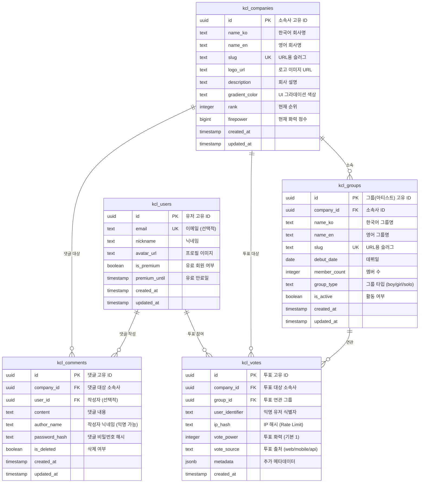

# KCL Database Schema Design (데이터베이스 스키마 설계)

> **작성일**: 2026-01-12  
> **담당**: Max (Backend Lead)  
> **Phase**: 1, Task T1.8  
> **상태**: 마이그레이션 스크립트 작성 완료 (T1.8)

---

## 📋 목차

1. [개요](#개요)
2. [ERD (Entity Relationship Diagram)](#erd-entity-relationship-diagram)
3. [테이블 명세](#테이블-명세)
4. [인덱스 전략](#인덱스-전략)
5. [RLS (Row Level Security) 정책](#rls-row-level-security-정책)
6. [데이터 무결성 제약조건](#데이터-무결성-제약조건)
7. [확장성 고려사항](#확장성-고려사항)

---

## 개요

### 설계 원칙

1. **네임스페이스 분리**: 모든 KCL 테이블은 `kcl_` 접두사 사용
2. **정규화**: 3NF 준수하되, 성능을 위해 필요 시 역정규화 고려
3. **확장성**: 향후 기능 추가를 고려한 컬럼 설계
4. **보안**: RLS 정책으로 데이터 접근 제어
5. **감사 추적**: 모든 테이블에 `created_at`, `updated_at` 타임스탬프

### 인프라 전략

- **Supabase 프로젝트**: 기존 프로젝트 활용 (신규 프로젝트 생성 안함)
- **Free Tier 절약**: 2개 슬롯 중 1개 절약
- **환경 통합**: 기존 환경 변수 및 관리 도구 재사용

---

## ERD (Entity Relationship Diagram)



---

## 테이블 명세

### 1. `kcl_companies` (소속사 정보)

**목적**: K-pop 엔터테인먼트 회사 정보 저장

| 컬럼명           | 타입        | Nullable | Default             | 설명                                 |
| ---------------- | ----------- | -------- | ------------------- | ------------------------------------ |
| `id`             | UUID        | NO       | `gen_random_uuid()` | Primary Key                          |
| `name_ko`        | TEXT        | NO       | -                   | 한국어 회사명 (예: "하이브")         |
| `name_en`        | TEXT        | NO       | -                   | 영어 회사명 (예: "HYBE")             |
| `slug`           | TEXT        | NO       | -                   | URL용 슬러그 (예: "hybe") **UNIQUE** |
| `logo_url`       | TEXT        | YES      | NULL                | 로고 이미지 URL (클라우드 스토리지)  |
| `description`    | TEXT        | YES      | NULL                | 회사 설명                            |
| `gradient_color` | TEXT        | YES      | '#8B5CF6'           | UI 그라데이션 색상 (Hex)             |
| `rank`           | INTEGER     | NO       | 999                 | 현재 순위 (1위부터 시작)             |
| `firepower`      | BIGINT      | NO       | 0                   | 현재 화력 점수 (누적 투표)           |
| `created_at`     | TIMESTAMPTZ | NO       | `now()`             | 생성일시                             |
| `updated_at`     | TIMESTAMPTZ | NO       | `now()`             | 수정일시 (트리거로 자동 업데이트)    |

**제약조건**:

- `UNIQUE(slug)`: 슬러그는 고유해야 함
- `CHECK(rank > 0)`: 순위는 1 이상
- `CHECK(firepower >= 0)`: 화력은 음수 불가

---

### 2. `kcl_groups` (아티스트/그룹 정보)

**목적**: 소속사별 아티스트(그룹) 정보 저장

| 컬럼명         | 타입        | Nullable | Default             | 설명                                     |
| -------------- | ----------- | -------- | ------------------- | ---------------------------------------- |
| `id`           | UUID        | NO       | `gen_random_uuid()` | Primary Key                              |
| `company_id`   | UUID        | NO       | -                   | Foreign Key → `kcl_companies(id)`        |
| `name_ko`      | TEXT        | NO       | -                   | 한국어 그룹명 (예: "방탄소년단")         |
| `name_en`      | TEXT        | NO       | -                   | 영어 그룹명 (예: "BTS")                  |
| `slug`         | TEXT        | NO       | -                   | URL용 슬러그 (예: "bts") **UNIQUE**      |
| `debut_date`   | DATE        | YES      | NULL                | 데뷔일                                   |
| `member_count` | INTEGER     | YES      | NULL                | 멤버 수                                  |
| `group_type`   | TEXT        | YES      | 'group'             | 그룹 타입 (boy/girl/solo/co-ed)          |
| `is_active`    | BOOLEAN     | NO       | true                | 활동 여부 (true: 활동, false: 해체/휴식) |
| `created_at`   | TIMESTAMPTZ | NO       | `now()`             | 생성일시                                 |
| `updated_at`   | TIMESTAMPTZ | NO       | `now()`             | 수정일시                                 |

**제약조건**:

- `UNIQUE(slug)`: 슬러그는 고유해야 함
- `FOREIGN KEY(company_id) REFERENCES kcl_companies(id) ON DELETE CASCADE`
- `CHECK(member_count > 0)`: 멤버 수는 1명 이상
- `CHECK(group_type IN ('boy', 'girl', 'solo', 'co-ed'))`: 타입 제한

---

### 3. `kcl_votes` (투표 내역)

**목적**: 유저의 투표 기록 저장 (익명 기반)

| 컬럼명            | 타입        | Nullable | Default             | 설명                                     |
| ----------------- | ----------- | -------- | ------------------- | ---------------------------------------- |
| `id`              | UUID        | NO       | `gen_random_uuid()` | Primary Key                              |
| `company_id`      | UUID        | NO       | -                   | Foreign Key → `kcl_companies(id)`        |
| `group_id`        | UUID        | YES      | NULL                | Foreign Key → `kcl_groups(id)` (선택적)  |
| `user_identifier` | TEXT        | YES      | NULL                | 익명 유저 식별자 (UUID 또는 fingerprint) |
| `ip_hash`         | TEXT        | NO       | -                   | IP 주소 해시 (Rate Limit 용도)           |
| `vote_power`      | INTEGER     | NO       | 1                   | 투표 화력 (기본 1, 부스터 시 증가)       |
| `vote_source`     | TEXT        | YES      | 'web'               | 투표 출처 (web/mobile/api)               |
| `metadata`        | JSONB       | YES      | NULL                | 추가 메타데이터 (기기 정보, 언어 등)     |
| `created_at`      | TIMESTAMPTZ | NO       | `now()`             | 투표 일시                                |

**제약조건**:

- `FOREIGN KEY(company_id) REFERENCES kcl_companies(id) ON DELETE CASCADE`
- `FOREIGN KEY(group_id) REFERENCES kcl_groups(id) ON DELETE SET NULL`
- `CHECK(vote_power > 0)`: 투표 화력은 1 이상
- `CHECK(vote_source IN ('web', 'mobile', 'api'))`: 출처 제한

**인덱스 전략**:

- 실시간 랭킹 계산을 위한 복합 인덱스 필수 (아래 인덱스 섹션 참조)

---

### 4. `kcl_comments` (댓글)

**목적**: 소속사별 응원 댓글 저장 (익명 기반, 비밀번호 보호)

| 컬럼명          | 타입        | Nullable | Default             | 설명                                   |
| --------------- | ----------- | -------- | ------------------- | -------------------------------------- |
| `id`            | UUID        | NO       | `gen_random_uuid()` | Primary Key                            |
| `company_id`    | UUID        | NO       | -                   | Foreign Key → `kcl_companies(id)`      |
| `user_id`       | UUID        | YES      | NULL                | Foreign Key → `kcl_users(id)` (선택적) |
| `content`       | TEXT        | NO       | -                   | 댓글 내용 (1~500자)                    |
| `author_name`   | TEXT        | NO       | 'Anonymous'         | 작성자 닉네임 (익명 가능)              |
| `password_hash` | TEXT        | NO       | -                   | 댓글 수정/삭제용 비밀번호 (bcrypt)     |
| `is_deleted`    | BOOLEAN     | NO       | false               | 삭제 여부 (soft delete)                |
| `created_at`    | TIMESTAMPTZ | NO       | `now()`             | 작성일시                               |
| `updated_at`    | TIMESTAMPTZ | NO       | `now()`             | 수정일시                               |

**제약조건**:

- `FOREIGN KEY(company_id) REFERENCES kcl_companies(id) ON DELETE CASCADE`
- `FOREIGN KEY(user_id) REFERENCES kcl_users(id) ON DELETE SET NULL`
- `CHECK(char_length(content) BETWEEN 1 AND 500)`: 댓글 길이 제한

---

### 5. `kcl_users` (유저 정보) - Phase 2 대비

**목적**: 로그인 기능 추가 시 사용 (Phase 1에서는 생성하되 사용 안함)

| 컬럼명          | 타입        | Nullable | Default             | 설명                        |
| --------------- | ----------- | -------- | ------------------- | --------------------------- |
| `id`            | UUID        | NO       | `gen_random_uuid()` | Primary Key                 |
| `email`         | TEXT        | YES      | NULL                | 이메일 (Supabase Auth 연동) |
| `nickname`      | TEXT        | YES      | NULL                | 닉네임                      |
| `avatar_url`    | TEXT        | YES      | NULL                | 프로필 이미지 URL           |
| `is_premium`    | BOOLEAN     | NO       | false               | 유료 회원 여부              |
| `premium_until` | TIMESTAMPTZ | YES      | NULL                | 유료 만료일                 |
| `created_at`    | TIMESTAMPTZ | NO       | `now()`             | 가입일시                    |
| `updated_at`    | TIMESTAMPTZ | NO       | `now()`             | 수정일시                    |

**제약조건**:

- `UNIQUE(email)`: 이메일 중복 불가

---

## 인덱스 전략

### 성능 최적화 목적

1. **실시간 랭킹 계산**: 투표 데이터 집계 속도 향상
2. **검색 기능**: 아티스트/회사명 검색 최적화
3. **댓글 조회**: 소속사별 댓글 페이지네이션 최적화

### 인덱스 정의

```sql
-- 1. kcl_companies: 슬러그 검색 (UNIQUE 제약조건으로 자동 생성)
-- CREATE UNIQUE INDEX idx_companies_slug ON kcl_companies(slug);

-- 2. kcl_companies: 순위 정렬
CREATE INDEX idx_companies_rank ON kcl_companies(rank ASC);

-- 3. kcl_groups: 소속사별 그룹 조회
CREATE INDEX idx_groups_company_id ON kcl_groups(company_id);

-- 4. kcl_groups: 슬러그 검색 (UNIQUE 제약조건으로 자동 생성)
-- CREATE UNIQUE INDEX idx_groups_slug ON kcl_groups(slug);

-- 5. kcl_votes: 실시간 랭킹 계산 (핵심!)
CREATE INDEX idx_votes_company_created ON kcl_votes(company_id, created_at DESC);

-- 6. kcl_votes: Rate Limit 체크 (IP 기반)
CREATE INDEX idx_votes_ip_created ON kcl_votes(ip_hash, created_at DESC);

-- 7. kcl_votes: 그룹별 투표 분석
CREATE INDEX idx_votes_group_created ON kcl_votes(group_id, created_at DESC)
WHERE group_id IS NOT NULL;

-- 8. kcl_comments: 소속사별 댓글 조회
CREATE INDEX idx_comments_company_created ON kcl_comments(company_id, created_at DESC)
WHERE is_deleted = false;

-- 9. kcl_users: 이메일 검색 (UNIQUE 제약조건으로 자동 생성)
-- CREATE UNIQUE INDEX idx_users_email ON kcl_users(email);
```

### 인덱스 사용 쿼리 예시

```sql
-- 실시간 랭킹 계산 (최근 24시간)
SELECT company_id, COUNT(*) as vote_count
FROM kcl_votes
WHERE created_at > NOW() - INTERVAL '24 hours'
GROUP BY company_id
ORDER BY vote_count DESC;
-- → idx_votes_company_created 인덱스 사용

-- IP 기반 Rate Limit 체크 (최근 1시간)
SELECT COUNT(*) as vote_count
FROM kcl_votes
WHERE ip_hash = 'hashed_ip_value'
  AND created_at > NOW() - INTERVAL '1 hour';
-- → idx_votes_ip_created 인덱스 사용
```

---

## RLS (Row Level Security) 정책

### 보안 원칙

1. **읽기 (SELECT)**: 모든 데이터 공개 (랭킹, 댓글 등)
2. **쓰기 (INSERT)**: 익명 투표/댓글 허용 (Rate Limit은 애플리케이션 레벨에서 처리)
3. **수정 (UPDATE)**: 댓글은 비밀번호 검증 후 허용, 나머지는 관리자만
4. **삭제 (DELETE)**: 관리자만 허용 (일반 유저는 soft delete)

### RLS 정책 SQL

```sql
-- 1. kcl_companies: 모든 사용자 읽기 가능, 수정은 관리자만
ALTER TABLE kcl_companies ENABLE ROW LEVEL SECURITY;

CREATE POLICY "공개: 모든 사용자 조회 가능"
ON kcl_companies FOR SELECT
USING (true);

CREATE POLICY "제한: 관리자만 수정 가능"
ON kcl_companies FOR UPDATE
USING (auth.role() = 'service_role');

-- 2. kcl_groups: 모든 사용자 읽기 가능, 수정은 관리자만
ALTER TABLE kcl_groups ENABLE ROW LEVEL SECURITY;

CREATE POLICY "공개: 모든 사용자 조회 가능"
ON kcl_groups FOR SELECT
USING (true);

CREATE POLICY "제한: 관리자만 수정 가능"
ON kcl_groups FOR UPDATE
USING (auth.role() = 'service_role');

-- 3. kcl_votes: 읽기 공개, 익명 투표 허용
ALTER TABLE kcl_votes ENABLE ROW LEVEL SECURITY;

CREATE POLICY "공개: 모든 사용자 조회 가능"
ON kcl_votes FOR SELECT
USING (true);

CREATE POLICY "공개: 익명 투표 허용"
ON kcl_votes FOR INSERT
WITH CHECK (true);
-- 주의: Rate Limit은 Edge Function 또는 Application Layer에서 처리

-- 4. kcl_comments: 읽기 공개, 익명 댓글 허용
ALTER TABLE kcl_comments ENABLE ROW LEVEL SECURITY;

CREATE POLICY "공개: 삭제되지 않은 댓글 조회"
ON kcl_comments FOR SELECT
USING (is_deleted = false);

CREATE POLICY "공개: 익명 댓글 작성 허용"
ON kcl_comments FOR INSERT
WITH CHECK (true);

-- 댓글 수정/삭제는 비밀번호 검증 후 Application Layer에서 처리
-- (RLS로는 비밀번호 검증 불가, Edge Function 필요)

-- 5. kcl_users: Phase 2 대비 (현재는 미사용)
ALTER TABLE kcl_users ENABLE ROW LEVEL SECURITY;

CREATE POLICY "공개: 프로필 조회 가능"
ON kcl_users FOR SELECT
USING (true);

CREATE POLICY "제한: 본인만 수정 가능"
ON kcl_users FOR UPDATE
USING (auth.uid() = id);
```

---

## 데이터 무결성 제약조건

### Foreign Key 설정

```sql
-- kcl_groups → kcl_companies
ALTER TABLE kcl_groups
ADD CONSTRAINT fk_groups_company
FOREIGN KEY (company_id) REFERENCES kcl_companies(id)
ON DELETE CASCADE;  -- 소속사 삭제 시 그룹도 삭제

-- kcl_votes → kcl_companies
ALTER TABLE kcl_votes
ADD CONSTRAINT fk_votes_company
FOREIGN KEY (company_id) REFERENCES kcl_companies(id)
ON DELETE CASCADE;  -- 소속사 삭제 시 투표도 삭제

-- kcl_votes → kcl_groups
ALTER TABLE kcl_votes
ADD CONSTRAINT fk_votes_group
FOREIGN KEY (group_id) REFERENCES kcl_groups(id)
ON DELETE SET NULL;  -- 그룹 삭제 시 NULL로 변경 (투표는 유지)

-- kcl_comments → kcl_companies
ALTER TABLE kcl_comments
ADD CONSTRAINT fk_comments_company
FOREIGN KEY (company_id) REFERENCES kcl_companies(id)
ON DELETE CASCADE;  -- 소속사 삭제 시 댓글도 삭제

-- kcl_comments → kcl_users (Phase 2)
ALTER TABLE kcl_comments
ADD CONSTRAINT fk_comments_user
FOREIGN KEY (user_id) REFERENCES kcl_users(id)
ON DELETE SET NULL;  -- 유저 삭제 시 익명 댓글로 변경
```

### 데이터베이스 트리거

```sql
-- updated_at 자동 업데이트 트리거 함수
CREATE OR REPLACE FUNCTION update_updated_at_column()
RETURNS TRIGGER AS $$
BEGIN
   NEW.updated_at = NOW();
   RETURN NEW;
END;
$$ LANGUAGE plpgsql;

-- 각 테이블에 트리거 적용
CREATE TRIGGER set_updated_at
BEFORE UPDATE ON kcl_companies
FOR EACH ROW
EXECUTE FUNCTION update_updated_at_column();

CREATE TRIGGER set_updated_at
BEFORE UPDATE ON kcl_groups
FOR EACH ROW
EXECUTE FUNCTION update_updated_at_column();

CREATE TRIGGER set_updated_at
BEFORE UPDATE ON kcl_comments
FOR EACH ROW
EXECUTE FUNCTION update_updated_at_column();

CREATE TRIGGER set_updated_at
BEFORE UPDATE ON kcl_users
FOR EACH ROW
EXECUTE FUNCTION update_updated_at_column();
```

---

## 확장성 고려사항

### Phase 2+ 확장 계획

1. **리그 시스템** (Phase 4):
   - `kcl_companies`에 `league` (TEXT) 컬럼 추가: 'royal', 'major', 'minor'
   - `season_id` (UUID) 추가로 시즌별 기록 관리

2. **결제 시스템** (Phase 2):
   - `kcl_payments` 테이블 신규 생성 (PortOne 연동)
   - `kcl_items` 테이블: 유료 아이템 정의 (긴급 총공, 커피차)

3. **실시간 화력 캐싱** (Phase 1B):
   - Upstash Redis 연동으로 `kcl_companies.firepower` 캐싱
   - 배치 집계 스케줄러 (5분마다)

4. **다국어 데이터**:
   - 현재: `name_ko`, `name_en` (2개 언어만)
   - 확장: `names` (JSONB) 컬럼으로 12개 언어 저장 고려

### 성능 모니터링 지표

- **투표 Insert 속도**: 목표 < 100ms (Redis Batching)
- **랭킹 계산 속도**: 목표 < 500ms (인덱스 + 캐싱)
- **댓글 조회 속도**: 목표 < 200ms (페이지네이션)

---

## 다음 단계 (Next Steps)

### Phase 1A: 스키마 설계 (현재 완료 ✅)

- [x] ERD 다이어그램 작성
- [x] 테이블 명세 정의
- [x] 인덱스 전략 수립
- [x] RLS 정책 설계

### Phase 1B: 구현 및 시딩 (T1.8, T1.9)

- [x] Migration SQL 검증 및 스크립트 작성 (`packages/kcl/scripts/migrate.ts`)
- [ ] Supabase Studio에서 테이블 생성 실행
- [ ] RLS 정책 활성화 및 테스트
- [ ] 초기 데이터 시딩 (50~100개 회사/그룹)

### Phase 1C: API 연동 (T1.10)

- [ ] Frontend Mock Data → Supabase Query 교체
- [ ] 실시간 랭킹 업데이트 로직 구현
- [ ] 투표 API 엔드포인트 구현

---

**작성자**: Max (Backend Lead)  
**검토**: Jeff Dean (CTO)  
**승인 대기**: 사용자 (CEO)
